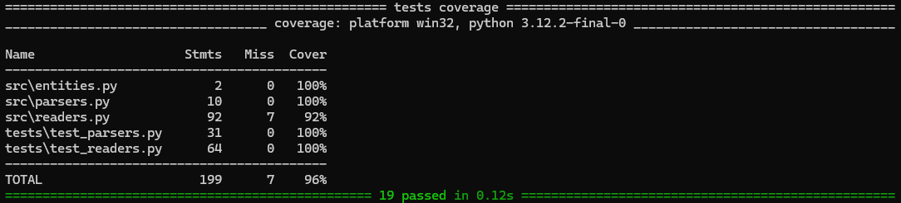
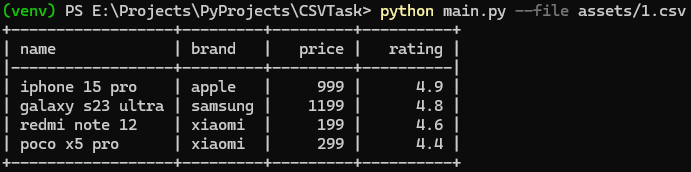
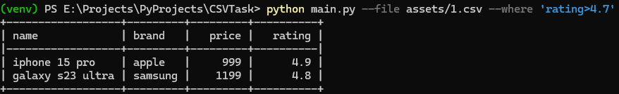
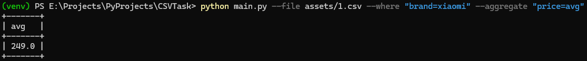

# CSVTask

## Images






## Installation
### clone project
```bash
git clone https://github.com/bigit22/CSVTask.git
```

### go to project folder
```bash
cd CSVTask
```

### create virtual environment
```bash
python -m venv venv
```

### activate virtual environment
windows
```bash
.\venv\Scripts\activate
```
or linux
```bash
source venv/bin/activate
```

### install requirements
```bash
pip install -r requirements.txt
```

## Usage
```
python main.py --file filepath [--where "condition"] [--aggregate "condition"]
```

### Examples
```bash
python main.py --file assets/1.csv
```
```bash
python main.py --file assets/1.csv --where "rating>4.7"
```
```bash
python main.py --file assets/1.csv --where "brand=apple"
```
```bash
python main.py --file assets/1.csv --aggregate "rating=avg"
```
```bash
python main.py --file assets/1.csv --where "brand=xiaomi" --aggregate "price=avg"
```

### if someone want to see the tests on Windows
```powershell
$env:PYTHONPATH="."
```
```bash
pytest --cov
```
